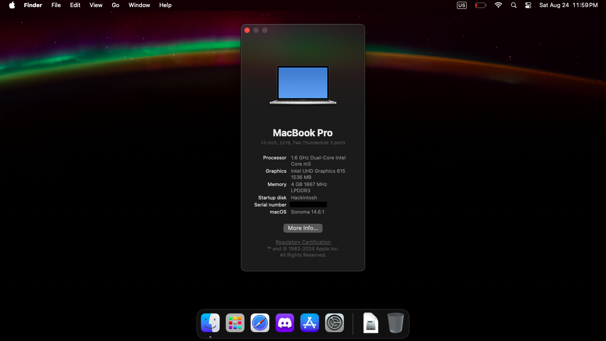

# Lenovo Thinkpad Yoga 11e Gen6 OpenCore EFI Guide

  

## Overview

This computer supports `Sonoma`, however `Ventura and earlier` work too.      

## Specs

<i>These are the specs of my laptop. This EFI can be used for all models of this machine.</i>

| Part             | Description                                                                                                    |
| ---------------- | -------------------------------------------------------------------------------------------------------------- |
| CPU              | Intel® Core™ m3-8100y Processor (Amber Lake Y architecture)                                                                              |
| iGPU             | Intel® UHD 615                                                                                                  |
| Memory           | 4gb soldered                                                                                |
| Storage          | SSD 256GB Western Digital SN520                                                                                |
| Display          | IPS 11,6 inch 1366x768                                                                                        |
| Wifi & Bluetooth | Intel® Wireless-AC 9260 Dual Band                                                                              |
| Touchpad         | Elan PS/2                                                                                                        |
| Touchscreen         | Elan i2c                                                                                                        |
| Keyboard         | Lenovo PS/2                                                                                                        |
| Audio            | Realtek ALC257                                                                                                 |
| External ports   | 2 x USB 3.0(?), 1 x Micro SD Card Reader, 1 x HDMI, 1 x 3.5 headphone/microphone combo, 1 x USB-C |

<h2>What works and what doesn't work?</h2>

| Part                                              | Status | Note                                                                               |
| ------------------------------------------------- | ------ | ---------------------------------------------------------------------------------- |
| Keyboard (with volume keys, media control keys, brightness keys) | ✅     |                                              |
| Touchscreen                                        | ✅     |                                                                                    |
| Touchpad & 5 keys & gestures                      | ✅     |  |
| Wifi                                              | ✅     |                                                                                    |
| Bluetooth                                         | ✅     |                                                                                    |
| SD Card Reader                                    | ✅     |                                                                                    |
| Camera & Mic                                      | ✅     |                                                                                   |
| Speaker & 3.5mm audio port                        | ✅     |                                                                                    |
| iGPU & HDMI                                 | ✅     |                                                                                    |
| USB                                               | ✅     |                                                                                    |
| Sleep                                             | ✅     |                                                                                    |
| Handoff                                           | ?     |                                                                                    |
| Airdrop                                           | ❌     |                                                                                    |
| Auto-Rotate                                           | ❌     |                                                                                    |

## How to make my efi? Where do i download it?
  - Use the dortania OpenCore guide [here](https://dortania.github.io/OpenCore-Install-Guide/)

## BIOS Settings
<pre>
  Security -> Intel SGX -> Intel SGX Control `[Disabled]`
  
  Security -> Secure Boot Configuration -> Secure Boot `[Disabled]`
  
  Security -> Virtualization -> Intel Virtualization Technology `[Enabled]`
  
  Security -> Virtualization -> Intel VT-D Feature `[Enabled]`
  
  Startup -> UEFI/Legacy Boot `[UEFI Only]`
               - CSM Support `[No]`  </pre>
## Recommendation
  - Use CorpNewt's SSDTTime for your ACPIs [here](https://github.com/corpnewt/SSDTTime)
      - <strong>READ EVERYTHING SSDTTime TELLS YOU!</strong>
      - First step, dump your systems ACPI tables, press P in SSDTTime
      - In SSDTTime, run these:
          - FixHpet
          - FakeEC Laptop (not needed on my machine, but can depend)
          - PluginType (<strong>not</strong> needed on 12.3 and newer)
          - PNLF
          - RTCAWAC
          - USBX
          - XOSI
          - DMAR
      - Next, copy all the .aml files from the Results folder
      - Then, run PatchMerge in the SSDTTime folder, and you'll figure out the rest
      - <strong>DON'T FORGET TO COPY THE PATCHED CONFIG PLIST FROM THE RESULTS FOLDER!!!</strong>

## The various quirks and problems i encountered
  <strong>AppleACPIPlatform Kernel Panic</strong>                                                          
      Solution: Install [CpuTSCSync](https://github.com/acidanthera/CpuTscSync/releases/) kext.
      
  <strong>Stuck around PCI Init</strong>                                                                              
      Solution: Add npci=0x2000 boot arg.

  <strong>Black screen/Acceleration issues</strong>                                                      
      Solution: Set the iGpu platform id to 00001B59 and add the DVMT patches in the guide (Total Graphics Memory in BIOS ≠ DVMT)

  <strong>RTL8153 USB-C Ethernet adapter not working on Sonoma</strong>  
      Solution: Add this kext [ECM-override.kext](https://github.com/dortania/OpenCore-Legacy-Patcher/blob/main/payloads/Kexts/Misc/ECM-Override-v1.0.0.zip)
